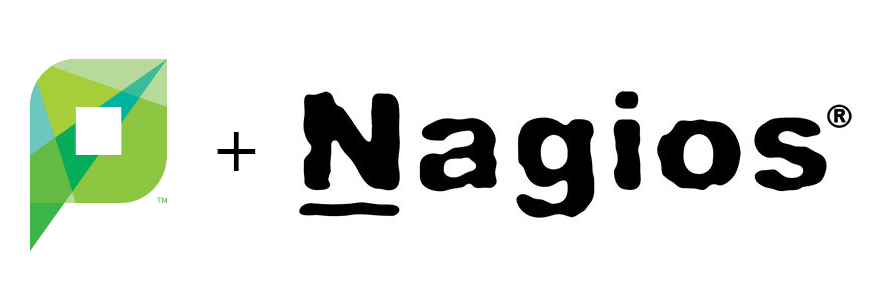

# check_papercut

Nagios plugin to check PaperCut NG/MF health using PaperCut API.

## **check_papercut** command line

```
Usage: check_papercut.sh options...
Options:
 -H, --hostname <host>  PaperCut host
 -s, --secure        Use HTTPS
 -p, --port <port>   PaperCut port
 -a, --authentication <auth>  PaperCut authorization key
 -t, --timeout <seconds>  Maximum time allowed for connection
 -w, --warning <value>  Warning interval
 -c, --critical <value>  Critical interval
 -d, --days <days>   License remaining days
 -v, --verbose       Make the operation more talkative
 -V, --version       Show version number and quit
 -h, --help          This help text
```


## Install **check_papercut** in Nagios

```
# Install plugin
[nagios@nagios]# cd /usr/local/nagios/libexec
[nagios@nagios]# git clone https://github.com/ramonromancastro/check_papercut.git

# Define command
[nagios@nagios]# cd /usr/local/nagios/etc
[nagios@nagios]# vi commands.cfg
...
define command{
    command_name  check_papercut
    command_line  /usr/local/nagios/libexec/check_papercut/check_papercut.sh -H $HOSTADDRESS$ $ARG1$
}

# Define server and service
[nagios@nagios]# vi /usr/local/nagios/etc/servers/papercut-server.cfg
define host{
    use        windows-server
    host_name  <HOSTNAME>
    address    <IP_ADDRESS>
    alias      PaperCut NG/MF Server
}

define service{
    use                  generic-service
    host_name            localhost
    service_description  PaperCut.Status
    check_command        check_papercut!--authentication <AUTHORIZATION_KEY>
}
```
### PaperCut NG/MF authorization key

[Discover the System Health interface authorization key](https://www.papercut.com/support/resources/manuals/ng-mf/common/topics/tools-monitor-system-health-api-authorization-key.html)

## Legal info

PaperCut logo owned by PaperCut Software International. Nagios logo is owned by Nagios Enterprises.
